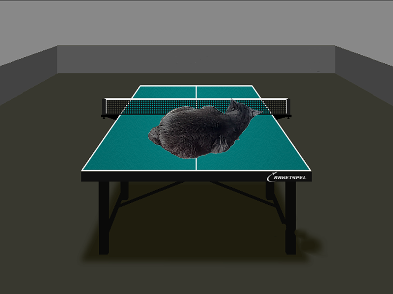

# Alpha-blending
Hello everyone!

In this project, I implemented the classic alpha blending. This program allows you to overlay one image on anther. The version without AVX2 optimization and the version with this optimisation were written, the analysis of the speed of the progrm in both cases was carried out. Below you can see the results :)

## Analysis

| In seconds  |       AVX2        |  Without AVX2  |
| :--------:  | :---------------: | :------------: | 
|     none    |       0.0589      |     0.0748     |
|     -O3     |       0.0029      |     0.0340     |
|    -Ofast   |       0.0026      |     0.0354     |

## Using
- Compilation: `make compile` in the console in the folder of this project;
- Run: `make run` in the console in the folder of this project.

## Result

Thank you for your attention! 
Good day :wave: :)
